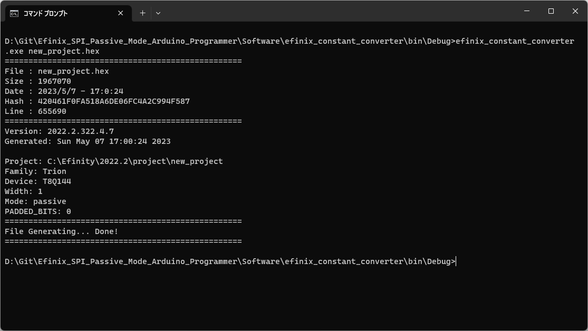
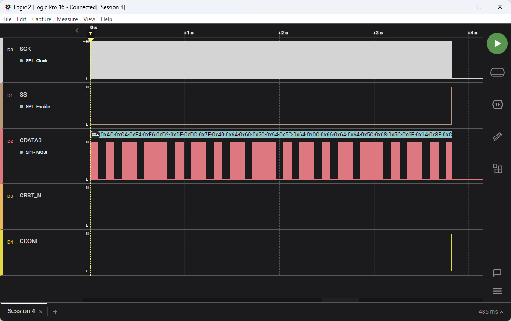

# Efinix SPI Passive Mode Arduino Programmer

Efinix社のFPGA「Trion T8」をSPIパッシブモードで使用するためのソフトウェア類。

「T8Q144I4」＋「Seeed Studio XIAO ESP32C3」テスト済み。


## Software

以下の環境でビルドを行った。

同じ手順でビルドが可能と思われる。


### Code::Blocks ビルド環境構築

http://www.codeblocks.org/downloads/binaries/

「codeblocks-20.03mingw-setup.exe」使用。


### Code::Blocks 設定 UTF-8化

「Settings」→「Editor」→「General settings」→「Encoding settings」

「UTF-8」を指定することと、「As default encoding」に切り替える。


### Code::Blocks 設定 Staticリンク化・エンコード変更

exe単体実行でDLLエラーが出ないように。

「Settings」→「Compiler」→「General compiler settings」→「Compiler settings」

「Compiler Flags」で「Static linking [-static]」にチェック。

「Other compiler options」で「-fexec-charset=CP932」と入力。

GCCは内部で文字列をUTF-8として扱うため、エンコードをUTF-8にしたほうが良い。

しかし、コマンドプロンプトがCP932で表示・入力を行うためビルド時にCP932向けにビルドを行う。


### Code::Blocks プロジェクト開いてビルド

「efinix_constant_converter.cbp」を開く。

Build Targetが「Debug」の場合は「Release」に切り替える。

「Build」→「Build」でビルド開始。

「bin/Release」フォルダ内にexeができる。


### 使用方法

  

コマンドプロンプトから以下のように使用する。

```
efinix_constant_converter.exe new_project.hex
```

引数で生成したビットストリームのhexファイルのパスを渡せばOK。

「Bitstream.h」ファイルが生成されるので、Arduinoプロジェクトに追加する。

hexファイルの生成に関しては以下を参照。


### ビットストリームファイルの生成

Efinity Software上で「File」→「Edit Project」とクリックし、「Project Editor」を開く。

「Project Editor」が開いたら「Bitstream Generation」タブで、「Passive」を選択する。

「Programming Mode」は「SPI passive x1」にする。

ただ、ヘッダーが変わるだけで中身は変わっていなかったので、Activeのままでも動作はすると思われる。

「Flow」から、「Synthesize」～「Generate Bitstream」まで行うと、ファイルが生成される。

Efinityプロジェクトフォルダ内にある「outflow」フォルダ以下に「プロジェクト名.hex」というファイルがあるため、これを変換する。

※ Efinity 2022.2.322.4.7 使用。


## Firmware

Arduino IDEでビルドできるファームウェア。

Seeed Studio XIAO ESP32C3 使用。


### ピン配置


| ピン | 接続先 |
----|----
| D1 | SS (OUTPUT, MCU->FPGA) |
| D2 | CDONE (INPUT, FPGA->MCU) |
| D3 | CRESET_N (OUTPUT, MCU->FPGA) |
| D8 | CCK  (SPI,SCK,OUTPUT, MCU->FPGA) |
| D9 |  *   (SPI,MISO,INPUT) |
| D10 | CDI0 (SPI,MOSI,OUTPUT) |

SPIを使用するため、D9（MISO）が入力になる。

FPGA側は大体プルアップが入っている。

「AN 006: Configuring Trion FPGAs（17ページ）」参照。


### ビルド環境・結果

Efinixのドキュメント「AN 006: Configuring Trion FPGAs（4ページ）」を参考にすると、ビットストリームのサイズは T8Q144I4 の場合で 5255968bit になる。

つまり、5255968 / 8 = 656996 Bytes となる。

フラッシュ領域が1MByte以上のマイコンでない限り、別途ストレージ（SDカード等）から読み込むことになると思われる。

今回は、「Seeed Studio XIAO ESP32C3」を使用。

4MBのフラッシュを搭載しているので大丈夫そう。


```
最大1310720バイトのフラッシュメモリのうち、スケッチが878180バイト（66%）を使っています。
最大327680バイトのRAMのうち、グローバル変数が15884バイト（4%）を使っていて、ローカル変数で311796バイト使うことができます。
```


実際にArduino環境でビルドしてみると、1.3MB程度しか見えてない？

とりあえずは収まるので大丈夫そうではある。

開発環境：Arduino IDE 2.1.0

ボード定義：esp32 by Espressif Systems 2.0.9

チップリビジョン：ESP32-C3 (revision v0.3)


### SPI速度に対する完了時間


  


SPIクロック周波数ごとのコンフィギュレーションにかかる時間。

実際に試した測定結果であるため環境によっては変動する可能性あり。


| 周波数 | 秒数 |
----|----
| 1000000 | 9.2 |
| 2000000 | 6.2 |
| 4000000 | 4.7 |
| 6000000 | 4.3 |
| 8000000 | 4.0 |
| **10000000** | 3.8 |
| 15000000 | 3.6 |
| 20000000 | 3.5 |
| 25000000 | 3.5 |
| 30000000 | 3.4 |
| 40000000 | 3.3 |
| 50000000 | 3.3 |

Passive mode X1の場合の最大周波数は25MHzのため、25MHzまでで動作させること。

それ以降はFPGA側が対応できない。

ビットストリームのデータをフラッシュ領域に置く都合でアクセスに時間がかかっている。

そのため、クロックを早くしても読み込みが追いつかず、3秒を切ることはできない。


### 参考資料

 - [T8 Data Sheet v4.7](https://www.efinixinc.com/docs/trion8-ds-v4.7.pdf)
 - [AN 006: Configuring Trion FPGAs v5.6](https://www.efinixinc.com/docs/an006-configuring-trion-fpgas-v5.6.pdf)
 - [AN 035: SPI Passive Programming with Raspberry Pi v1.2](https://www.efinixinc.com/docs/an035-spi-passive-programming-with-rpi-v1.2.pdf)
 - [Example Design: SPI Passive Programming with Raspberry Pi](https://www.efinixinc.com/support/ed/t20-passive-programming-rpi.php)


